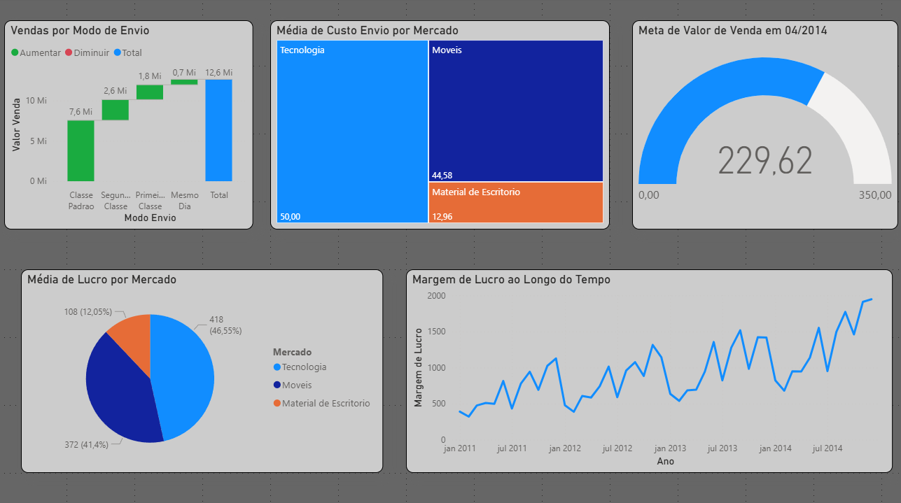

#  Análise de Marketing com Power BI

Este projeto consiste em um dashboard interativo construído no Power BI com foco em indicadores de marketing, usando dados simulados. O objetivo é aplicar visualização de dados e análise exploratória para acompanhar metas, lucro e desempenho por categoria.

##  Ferramentas Utilizadas

- Power BI
- DAX (Data Analysis Expressions)
- Power Query
- Excel / CSV

## Como Abrir o Projeto

1. Faça o download do arquivo `Dashboard.pbix` presente no repositório.
2. Abra o arquivo utilizando o [Power BI Desktop](https://powerbi.microsoft.com/pt-br/desktop/).
3. Os dados utilizados estão disponíveis na pasta `Base-Dados`, no arquivo `dados_marketing.csv`.
4. Caso deseje visualizar o dashboard sem abrir o Power BI, acesse a imagem na pasta `imagens`.

##  Objetivos do Projeto

- Acompanhar o desempenho de lucro ao longo do tempo
- Verificar a média de custos e lucros por mercado
- Analisar o impacto do modo de envio nas vendas
- Monitorar metas mensais de vendas

##  Indicadores Apresentados

- Vendas por Modo de Envio (Gráfico de Cascata)
- Média de Custo por Mercado (Treemap)
- Meta de Valor de Venda (Gráfico Velocímetro)
- Média de Lucro por Mercado (Pizza)
- Margem de Lucro ao Longo do Tempo (Linha Temporal)

##  Imagem do Dashboard

---

> Projeto criado por Gabriel F. Rodrigues de Souza – Estudante de Análise e Desenvolvimento de Sistemas com foco em Análise de Dados.
